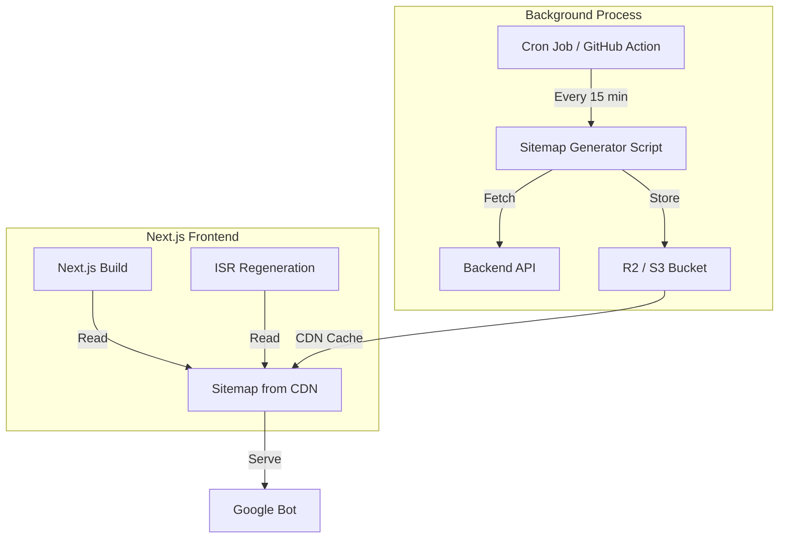

# Production Sitemap Generation Strategy

## 🎯 Problem Statement

Current sitemap generation is **build-coupled**:
- Next.js build process → Fetches from Backend API
- If backend is slow/down/redeploying → Build degrades or fails
- Even with timeouts + caching, there's still a dependency

## ✅ Solution: Decoupled Sitemap Generation

### Architecture Overview



---

## 📋 Implementation Options

### Option A: GitHub Actions Cron (Recommended for Railway/Vercel)

**Frequency**: Every 15-30 minutes  
**Cost**: Free (GitHub Actions includes 2000 minutes/month)  
**Complexity**: Low

#### 1. Create Sitemap Generator Script

Create `scripts/generate-sitemap.ts`:

```typescript
#!/usr/bin/env ts-node
/**
 * Standalone sitemap generator - runs outside of Next.js build
 * Generates pre-built sitemap files and uploads to R2/S3
 */

import { writeFileSync } from 'fs';
import { join } from 'path';
import { S3Client, PutObjectCommand } from '@aws-sdk/client-s3';

const BACKEND_URL = process.env.BACKEND_API_URL || 'https://your-backend.up.railway.app';
const BUCKET_NAME = process.env.R2_BUCKET_NAME || 'autobacs-sitemaps';
const PRODUCTS_PER_PAGE = 250;
const MAX_PRODUCTS = 5000;

interface SitemapEntry {
  url: string;
  lastModified: string;
  changeFrequency: string;
  priority: number;
}

async function fetchProducts(page: number): Promise<any[]> {
  const res = await fetch(
    `${BACKEND_URL}/products?limit=${PRODUCTS_PER_PAGE}&page=${page}`,
    { next: { revalidate: 3600 } }
  );
  
  if (!res.ok) throw new Error(`Failed to fetch products: ${res.status}`);
  
  const data = await res.json();
  return data.products || [];
}

async function fetchCategories(): Promise<any[]> {
  const res = await fetch(`${BACKEND_URL}/categories`);
  if (!res.ok) throw new Error(`Failed to fetch categories: ${res.status}`);
  
  const data = await res.json();
  return data.categories || [];
}

async function fetchArticles(): Promise<any[]> {
  const res = await fetch(`${BACKEND_URL}/media/articles?limit=2000`);
  if (!res.ok) throw new Error(`Failed to fetch articles: ${res.status}`);
  
  const data = await res.json();
  return data.data || [];
}

function generateProductSitemap(products: any[]): SitemapEntry[] {
  return products
    .filter(p => p.slug)
    .map(p => ({
      url: `https://autobacsindia.com/products/${p.slug}`,
      lastModified: new Date(p.updatedAt).toISOString(),
      changeFrequency: 'daily',
      priority: 0.6,
    }));
}

function generateCategorySitemap(categories: any[]): SitemapEntry[] {
  return categories.map(cat => ({
    url: `https://autobacsindia.com/categories/${cat.slug || cat._id}`,
    lastModified: new Date(cat.updatedAt).toISOString(),
    changeFrequency: 'weekly',
    priority: 0.7,
  }));
}

function generateArticleSitemap(articles: any[]): SitemapEntry[] {
  return articles.map(article => ({
    url: `https://autobacsindia.com/media/${article.type}/${article.slug}`,
    lastModified: new Date(article.updatedAt || article.publishedAt).toISOString(),
    changeFrequency: 'weekly',
    priority: 0.7,
  }));
}

function generateStaticSitemap(): SitemapEntry[] {
  return [
    { url: 'https://autobacsindia.com/', lastModified: new Date().toISOString(), changeFrequency: 'daily', priority: 1.0 },
    { url: 'https://autobacsindia.com/shop', lastModified: new Date().toISOString(), changeFrequency: 'daily', priority: 0.8 },
    { url: 'https://autobacsindia.com/media', lastModified: new Date().toISOString(), changeFrequency: 'daily', priority: 0.8 },
    { url: 'https://autobacsindia.com/about', lastModified: new Date().toISOString(), changeFrequency: 'monthly', priority: 0.5 },
    { url: 'https://autobacsindia.com/contact', lastModified: new Date().toISOString(), changeFrequency: 'monthly', priority: 0.5 },
  ];
}

function generateSitemapIndex(shardUrls: string[]): string {
  return `<?xml version="1.0" encoding="UTF-8"?>
<sitemapindex xmlns="http://www.sitemaps.org/schemas/sitemap/0.9">
  ${shardUrls.map(url => `  <sitemap><loc>${url}</loc><lastmod>${new Date().toISOString()}</lastmod></sitemap>`).join('\n')}
</sitemapindex>`;
}

function generateSitemapXML(entries: SitemapEntry[]): string {
  return `<?xml version="1.0" encoding="UTF-8"?>
<urlset xmlns="http://www.sitemaps.org/schemas/sitemap/0.9">
  ${entries.map(entry => `  <url>
    <loc>${entry.url}</loc>
    <lastmod>${entry.lastModified}</lastmod>
    <changefreq>${entry.changeFrequency}</changefreq>
    <priority>${entry.priority}</priority>
  </url>`).join('\n')}
</urlset>`;
}

async function uploadToR2(key: string, content: string): Promise<void> {
  const client = new S3Client({
    region: 'auto',
    endpoint: process.env.R2_ENDPOINT!,
    credentials: {
      accessKeyId: process.env.R2_ACCESS_KEY_ID!,
      secretAccessKey: process.env.R2_SECRET_ACCESS_KEY!,
    },
  });

  await client.send(new PutObjectCommand({
    Bucket: BUCKET_NAME,
    Key: key,
    Body: content,
    ContentType: 'application/xml',
    CacheControl: 'public, max-age=3600', // 1 hour cache
  }));

  console.log(`✓ Uploaded ${key}`);
}

async function main() {
  console.log('🚀 Starting sitemap generation...');
  
  try {
    // Fetch all data in parallel
    const [products, categories, articles] = await Promise.all([
      fetchProducts(1),
      fetchCategories(),
      fetchArticles(),
    ]);

    console.log(`✓ Fetched ${products.length} products, ${categories.length} categories, ${articles.length} articles`);

    // Generate sitemaps
    const staticSitemap = generateStaticSitemap();
    const categorySitemap = generateCategorySitemap(categories);
    const articleSitemap = generateArticleSitemap(articles);
    
    // Upload shard 0 (static + categories)
    const shard0 = [...staticSitemap, ...categorySitemap];
    await uploadToR2('sitemap-0.xml', generateSitemapXML(shard0));
    
    // Upload shard 1 (articles)
    await uploadToR2('sitemap-1.xml', generateSitemapXML(articleSitemap));

    // Upload product shards
    const totalProducts = Math.min(products.length, MAX_PRODUCTS);
    const productShards = Math.ceil(totalProducts / PRODUCTS_PER_PAGE);
    
    for (let i = 0; i < productShards; i++) {
      const start = i * PRODUCTS_PER_PAGE;
      const end = start + PRODUCTS_PER_PAGE;
      const shardProducts = products.slice(start, end);
      
      const shardId = i + 2; // Product shards start at ID 2
      await uploadToR2(`sitemap-${shardId}.xml`, generateSitemapXML(generateProductSitemap(shardProducts)));
    }

    // Generate sitemap index
    const shardUrls = Array.from(
      { length: productShards + 2 }, 
      (_, i) => `https://autobacsindia.com/sitemap-${i}.xml`
    );
    
    const indexXml = generateSitemapIndex(shardUrls);
    await uploadToR2('sitemap.xml', indexXml);

    console.log(`✅ Generated ${productShards + 2} sitemap shards successfully`);
    
  } catch (error) {
    console.error('❌ Sitemap generation failed:', error);
    process.exit(1);
  }
}

main();
```

#### 2. Create GitHub Action Workflow

Create `.github/workflows/generate-sitemap.yml`:

```yaml
name: Generate Sitemap

on:
  schedule:
    # Run every 30 minutes
    - cron: '*/30 * * * *'
  
  # Allow manual trigger
  workflow_dispatch:

jobs:
  generate:
    runs-on: ubuntu-latest
    
    steps:
      - name: Checkout
        uses: actions/checkout@v4

      - name: Setup Node.js
        uses: actions/setup-node@v4
        with:
          node-version: '20'

      - name: Install dependencies
        run: |
          npm install -g ts-node
          npm install @aws-sdk/client-s3

      - name: Generate and upload sitemap
        env:
          BACKEND_API_URL: ${{ secrets.BACKEND_API_URL }}
          R2_ENDPOINT: ${{ secrets.R2_ENDPOINT }}
          R2_ACCESS_KEY_ID: ${{ secrets.R2_ACCESS_KEY_ID }}
          R2_SECRET_ACCESS_KEY: ${{ secrets.R2_SECRET_ACCESS_KEY }}
          R2_BUCKET_NAME: ${{ secrets.R2_BUCKET_NAME }}
        run: ts-node scripts/generate-sitemap.ts
```

#### 3. Update Next.js to Use Prebuilt Sitemap

Update `app/sitemap.ts` to simply read from the prebuilt file:

```typescript
import { MetadataRoute } from 'next';

export default async function sitemap({
  id,
}: {
  id: number;
}): Promise<MetadataRoute.Sitemap> {
  // Read pre-generated sitemap from public folder or CDN
  const baseUrl = process.env.NEXT_PUBLIC_APP_URL || 'http://localhost:3000';
  const sitemapUrl = `${baseUrl}/sitemaps/sitemap-${id}.xml`;
  
  try {
    // In production, this would be from your CDN/R2 bucket
    // For now, we'll read from public/sitemaps/
    const response = await fetch(sitemapUrl);
    
    if (!response.ok) {
      throw new Error(`Failed to fetch sitemap ${id}`);
    }
    
    // Parse XML and convert to MetadataRoute.Sitemap format
    // Or just return empty and let search engines read the XML directly
    return [];
    
  } catch (err) {
    console.error(`[SITEMAP] Failed to load prebuilt sitemap ${id}:`, err);
    return [];
  }
}

export async function generateSitemaps(): Promise<{ id: number }[]> {
  // Return fixed number of shards based on expected data
  // This is now decoupled from real-time API calls
  return Array.from({ length: 10 }, (_, i) => ({ id: i }));
}
```

---

### Option B: Railway Cron Service (Alternative)

**Frequency**: Continuous (runs as a separate service)  
**Cost**: ~$5/month (Railway hobby plan)  
**Complexity**: Medium

Deploy the generator script as a separate Railway service that runs on a cron schedule.

---

### Option C: Hybrid Approach (Best of Both Worlds)

Use the current in-memory caching for development + prebuilt sitemaps for production:

```typescript
// app/sitemap.ts

const USE_PREBUILT = process.env.NODE_ENV === 'production';

if (USE_PREBUILT) {
  // Load from CDN/R2
  return loadFromCDN(id);
} else {
  // Fetch from API with caching
  return fetchAndCache(id);
}
```

---

## 🔧 Setup Instructions

### 1. Cloudflare R2 Bucket Setup

```bash
# Create bucket
wrangler r2 bucket create autobacs-sitemaps

# Get credentials from Cloudflare dashboard
# Add to GitHub Secrets:
# - R2_ENDPOINT
# - R2_ACCESS_KEY_ID
# - R2_SECRET_ACCESS_KEY
# - R2_BUCKET_NAME
```

### 2. Configure CORS for R2 Bucket

Allow Next.js frontend to serve the sitemaps:

```json
{
  "CORSRules": [
    {
      "AllowedOrigins": ["*"],
      "AllowedMethods": ["GET", "HEAD"],
      "AllowedHeaders": ["*"],
      "MaxAgeSeconds": 3600
    }
  ]
}
```

### 3. Test Locally

```bash
# Set environment variables
export BACKEND_API_URL=http://localhost:5000
export R2_ENDPOINT=...
export R2_ACCESS_KEY_ID=...
export R2_SECRET_ACCESS_KEY=...

# Run generator
ts-node scripts/generate-sitemap.ts
```

---

## 📊 Benefits Comparison

| Aspect | Current (Build-Coupled) | Precomputed (Decoupled) |
|--------|-------------------------|-------------------------|
| **Build Speed** | Slow (API calls during build) | Fast (reads static files) |
| **Reliability** | Depends on backend availability | Independent of backend |
| **Freshness** | Real-time during build | 15-30 min delay |
| **SEO Risk** | Empty sitemaps if API fails | Always has data |
| **Cost** | Free | Free (GitHub Actions) |
| **Complexity** | Low | Medium |

---

## ✅ Recommended Migration Path

### Phase 1: Implement Stale-While-Revalidate (DONE ✅)
- Already implemented in current code
- Provides immediate resilience

### Phase 2: Add Precomputed Sitemap (Next Step)
1. Set up R2 bucket
2. Create generator script
3. Configure GitHub Actions cron
4. Test locally

### Phase 3: Gradual Rollout
1. Deploy to staging first
2. Monitor Google Search Console
3. Gradually increase update frequency
4. Remove build-time API dependency

---

## 🚨 Important Notes

### SEO Considerations
- **Stale data is better than missing data** - Google prefers consistent sitemaps
- **30-minute delay is acceptable** - Most ecommerce sites update sitemaps daily
- **Version control** - Keep track of sitemap generation logs

### Monitoring
Add these checks:
```typescript
// Log sitemap stats
console.log(`Generated sitemap with ${totalUrls} URLs`);
console.log(`Cache hit rate: ${cacheHits}/${totalRequests}`);
```

### Rollback Plan
If precomputed sitemaps fail:
```typescript
// Fallback to live generation
if (prebuilt fails) {
  return fetchFromAPI();
}
```

---

## 📝 Conclusion

The **stale-while-revalidate** pattern (already implemented) provides immediate resilience. 

For **ultimate reliability**, implement **Option A (GitHub Actions + R2)** to completely decouple sitemap generation from your build process.

This ensures:
✅ Zero build failures due to backend issues  
✅ Faster builds (no API calls)  
✅ Consistent sitemaps for Google  
✅ Better SEO performance  

Choose the approach that matches your production requirements! 🎯
