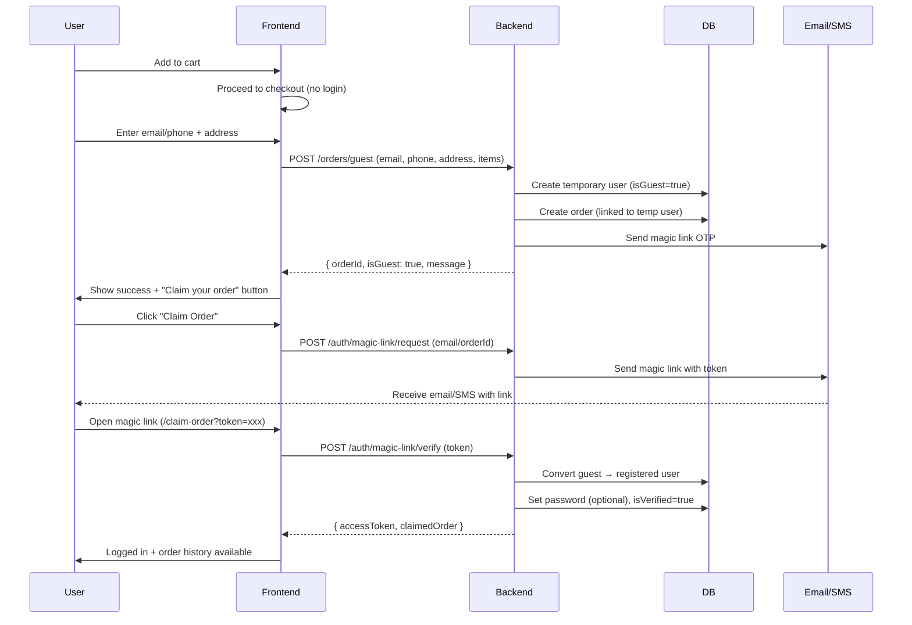

# Guest Checkout with Magic Link Implementation Guide

## 🎯 Overview

Implement a **guest-first checkout** flow that allows users to place orders without creating an account, then optionally claim ownership via magic link/OTP after purchase.

### Benefits
- ✅ **Reduce cart abandonment** (no forced registration)
- ✅ **Faster checkout** (2-3 minutes vs 5-10 minutes)
- ✅ **Better UX** (matches Indian e-commerce standards: Nykaa, Myntra, Ajio)
- ✅ **Account conversion** (post-purchase magic link = higher engagement)

---

## 📊 Flow Diagram



---

## 🔧 Backend Implementation

### 1. Update User Model

Add guest user support:

```javascript
// models/User.js

const userSchema = new mongoose.Schema({
  // ... existing fields ...
  
  // NEW: Guest user flag
  isGuest: {
    type: Boolean,
    default: false,
    index: true
  },
  
  // NEW: Magic link token for claiming account
  magicLinkToken: String,
  magicLinkExpires: Date,
  
  // NEW: Claimed orders (for guest users who convert)
  claimedOrders: [{
    type: mongoose.Schema.Types.ObjectId,
    ref: 'Order'
  }]
}, { timestamps: true });
```

### 2. Create Guest Order Route

```javascript
// routes/orders.js

import express from 'express';
import { createGuestOrder } from '../controllers/orderController.js';
import { validateOrder } from '../middleware/validationMiddleware.js';

const router = express.Router();

/**
 * POST /orders/guest
 * Create order without authentication
 * Creates temporary guest user record
 */
router.post('/guest', validateOrder, createGuestOrder);

export default router;
```

### 3. Update Order Controller

```javascript
// controllers/orderController.js

import User from '../models/User.js';
import crypto from 'crypto';
import bcrypt from 'bcryptjs';

// @desc    Create guest order (no auth required)
// @route   POST /orders/guest
// @access  Public
export const createGuestOrder = async (req, res) => {
  try {
    const { items, shippingAddress, paymentMethod, email, phone } = req.body;
    
    // Validate contact info (at least one required)
    if (!email && !phone) {
      return res.status(400).json({
        success: false,
        message: 'Either email or phone is required'
      });
    }
    
    // Find or create guest user
    let user;
    const searchCriteria = email 
      ? { email: email.toLowerCase() }
      : { phone };
    
    user = await User.findOne(searchCriteria);
    
    if (!user) {
      // Create temporary guest user
      const randomPassword = crypto.randomBytes(16).toString('hex');
      const salt = await bcrypt.genSalt(10);
      const passwordHash = await bcrypt.hash(randomPassword, salt);
      
      user = await User.create({
        name: shippingAddress.fullName || 'Guest User',
        email: email?.toLowerCase(),
        phone,
        passwordHash,
        isGuest: true,
        isVerified: false,
        addresses: [shippingAddress]
      });
    } else if (user.isGuest) {
      // Update existing guest user's address
      user.addresses.push(shippingAddress);
      await user.save();
    }
    
    // Use existing order creation logic
    const order = await createOrderInternal(user, items, shippingAddress, paymentMethod, req.body);
    
    // Generate magic link for claiming account
    const magicToken = crypto.randomBytes(32).toString('hex');
    user.magicLinkToken = magicToken;
    user.magicLinkExpires = new Date(Date.now() + 24 * 60 * 60 * 1000); // 24 hours
    await user.save();
    
    // TODO: Send email/SMS with magic link
    // await sendMagicLinkEmail(user.email, magicToken, order._id);
    
    res.status(201).json({
      success: true,
      order: {
        _id: order._id,
        orderNumber: order.orderNumber,
        totalAmount: order.totalAmount,
        status: order.status
      },
      isGuest: true,
      message: 'Order created successfully! Check your email to claim your account.',
      magicLinkToken: magicToken // In production, only send via email
    });
    
  } catch (error) {
    console.error('[GUEST_ORDER_ERROR]', error);
    res.status(500).json({
      success: false,
      message: 'Failed to create guest order',
      error: error.message
    });
  }
};

// Internal helper for order creation (extracted from existing createOrder)
async function createOrderInternal(user, items, shippingAddress, paymentMethod, orderData) {
  // ... existing order creation logic from createOrder() ...
}
```

### 4. Magic Link Authentication Routes

```javascript
// routes/auth.js

import express from 'express';
import { 
  requestMagicLink, 
  verifyMagicLink,
  resendMagicLink 
} from '../controllers/authController.js';

const router = express.Router();

/**
 * POST /auth/magic-link/request
 * Send magic link to guest user's email/phone
 */
router.post('/magic-link/request', requestMagicLink);

/**
 * POST /auth/magic-link/verify
 * Verify magic link token and convert guest to registered user
 */
router.post('/magic-link/verify', verifyMagicLink);

/**
 * POST /auth/magic-link/resend
 * Resend magic link if expired or not received
 */
router.post('/magic-link/resend', resendMagicLink);

export default router;
```

### 5. Magic Link Auth Controller

```javascript
// controllers/authController.js

import crypto from 'crypto';
import bcrypt from 'bcryptjs';
import User from '../models/User.js';
import Order from '../models/Order.js';
import { generateToken } from '../middleware/authMiddleware.js';

// @desc    Request magic link for guest order
// @route   POST /auth/magic-link/request
// @access  Public
export const requestMagicLink = async (req, res) => {
  try {
    const { email, phone, orderId } = req.body;
    
    if (!email && !phone) {
      return res.status(400).json({
        success: false,
        message: 'Email or phone is required'
      });
    }
    
    // Find user
    const user = await User.findOne(
      email ? { email: email.toLowerCase() } : { phone }
    );
    
    if (!user) {
      return res.status(404).json({
        success: false,
        message: 'No account found with this email/phone'
      });
    }
    
    // Generate magic link token
    const token = crypto.randomBytes(32).toString('hex');
    user.magicLinkToken = token;
    user.magicLinkExpires = new Date(Date.now() + 24 * 60 * 60 * 1000); // 24h
    await user.save();
    
    // TODO: Send email/SMS
    // await sendMagicLinkEmail(user.email, token, orderId);
    // await sendMagicLinkSMS(user.phone, token);
    
    console.log('[MAGIC_LINK_REQUEST]', {
      email: user.email,
      orderId,
      token // Remove in production
    });
    
    res.json({
      success: true,
      message: `Magic link sent to ${email || phone}`,
      debugToken: process.env.NODE_ENV === 'development' ? token : undefined
    });
    
  } catch (error) {
    console.error('[MAGIC_LINK_REQUEST_ERROR]', error);
    res.status(500).json({
      success: false,
      message: 'Failed to send magic link',
      error: error.message
    });
  }
};

// @desc    Verify magic link and claim account
// @route   POST /auth/magic-link/verify
// @access  Public
export const verifyMagicLink = async (req, res) => {
  try {
    const { token, password } = req.body;
    
    if (!token) {
      return res.status(400).json({
        success: false,
        message: 'Token is required'
      });
    }
    
    // Find user by token
    const user = await User.findOne({
      magicLinkToken: token,
      magicLinkExpires: { $gt: new Date() } // Not expired
    });
    
    if (!user) {
      return res.status(400).json({
        success: false,
        message: 'Invalid or expired magic link'
      });
    }
    
    // Convert guest to registered user
    if (user.isGuest) {
      // Optional: Set password if provided
      if (password) {
        const salt = await bcrypt.genSalt(10);
        user.passwordHash = await bcrypt.hash(password, salt);
      }
      
      user.isGuest = false;
      user.isVerified = true;
      user.verifiedAt = new Date();
      user.magicLinkToken = undefined;
      user.magicLinkExpires = undefined;
      
      await user.save();
    }
    
    // Generate JWT token
    const accessToken = generateToken(user);
    
    res.json({
      success: true,
      accessToken,
      user: {
        id: user._id,
        name: user.name,
        email: user.email,
        role: user.role,
        isVerified: user.isVerified
      },
      message: 'Account claimed successfully!'
    });
    
  } catch (error) {
    console.error('[MAGIC_LINK_VERIFY_ERROR]', error);
    res.status(500).json({
      success: false,
      message: 'Failed to verify magic link',
      error: error.message
    });
  }
};

// @desc    Resend magic link
// @route   POST /auth/magic-link/resend
// @access  Public
export const resendMagicLink = async (req, res) => {
  try {
    const { email, phone, orderId } = req.body;
    
    // Reuse requestMagicLink logic
    await requestMagicLink({ ...req, body: { email, phone, orderId } }, res);
    
  } catch (error) {
    console.error('[MAGIC_LINK_RESEND_ERROR]', error);
    res.status(500).json({
      success: false,
      message: 'Failed to resend magic link',
      error: error.message
    });
  }
};
```

### 6. Email Service Integration

```javascript
// services/emailService.js

import nodemailer from 'nodemailer';

const transporter = nodemailer.createTransport({
  host: process.env.SMTP_HOST,
  port: process.env.SMTP_PORT,
  secure: false,
  auth: {
    user: process.env.SMTP_USER,
    pass: process.env.SMTP_PASS,
  },
});

export async function sendMagicLinkEmail(email, token, orderId) {
  const magicUrl = `${process.env.FRONTEND_URL}/claim-order?token=${token}`;
  
  const html = `
    <div style="font-family: Arial, sans-serif; max-width: 600px; margin: 0 auto;">
      <h2 style="color: #2563eb;">Claim Your Autobacs Order</h2>
      <p>Thank you for your order!</p>
      <p>Click the button below to claim your account and track your order:</p>
      
      <a href="${magicUrl}" 
         style="display: inline-block; background: #2563eb; color: white; padding: 12px 24px; text-decoration: none; border-radius: 6px; margin: 20px 0;">
        Claim My Account
      </a>
      
      <p>Or copy this link:</p>
      <p style="word-break: break-all; color: #666;">${magicUrl}</p>
      
      <p style="color: #999; font-size: 12px; margin-top: 30px;">
        This link expires in 24 hours.<br/>
        If you didn't place this order, please ignore this email.
      </p>
      
      <hr style="border: none; border-top: 1px solid #eee; margin-top: 20px;"/>
      <p style="color: #999; font-size: 12px;">Autobacs India</p>
    </div>
  `;
  
  await transporter.sendMail({
    from: `"Autobacs India" <${process.env.SMTP_FROM_EMAIL}>`,
    to: email,
    subject: 'Claim Your Autobacs Order - Magic Link Inside',
    html,
  });
  
  console.log('[MAGIC_LINK_EMAIL_SENT]', { email, orderId });
}

export async function sendMagicLinkSMS(phone, token) {
  // Implement using your SMS provider (Twilio, MSG91, etc.)
  const message = `Your Autobacs magic link: ${process.env.FRONTEND_URL}/claim-order?token=${token}. Valid for 24h.`;
  
  // TODO: Integrate with SMS gateway
  console.log('[MAGIC_LINK_SMS]', { phone, message });
}
```

---

## 🎨 Frontend Implementation

### 7. Update Checkout Page (Guest Flow)

```typescript
// app/checkout/page.tsx

'use client';

import { useState } from 'react';
import { useCart } from '@/context/CartContext';
import apiClient from '@/lib/api';
import toast from 'react-hot-toast';

export default function CheckoutPage() {
  const { cart, clearCart } = useCart();
  const [isGuest, setIsGuest] = useState(true);
  const [guestEmail, setGuestEmail] = useState('');
  const [guestPhone, setGuestPhone] = useState('');
  const [orderId, setOrderId] = useState<string | null>(null);
  const [magicLinkSent, setMagicLinkSent] = useState(false);

  const handleGuestCheckout = async (e: React.FormEvent) => {
    e.preventDefault();
    
    if (!guestEmail && !guestPhone) {
      toast.error('Please enter email or phone number');
      return;
    }

    try {
      const response = await apiClient.post('/orders/guest', {
        items: cart.items.map(item => ({
          product: item.product._id || item.product.id,
          quantity: item.quantity,
        })),
        shippingAddress: address,
        paymentMethod,
        email: guestEmail,
        phone: guestPhone,
      });

      if (response.success) {
        setOrderId(response.order._id);
        setMagicLinkSent(true);
        await clearCart();
        
        toast.success('Order placed! Check your email to claim your account.');
        
        // Store order info for claim page
        localStorage.setItem('pendingClaim', JSON.stringify({
          orderId: response.order._id,
          email: guestEmail,
          magicToken: response.magicLinkToken, // In production, only from email
        }));
        
        // Redirect to confirmation
        setCurrentStep('confirmation');
      }
    } catch (error: any) {
      console.error('Guest checkout failed:', error);
      toast.error(error.response?.data?.message || 'Failed to place order');
    }
  };

  const handleRequestMagicLink = async () => {
    try {
      await apiClient.post('/auth/magic-link/request', {
        email: guestEmail,
        phone: guestPhone,
        orderId,
      });
      
      toast.success('Magic link sent to your email!');
    } catch (error) {
      toast.error('Failed to send magic link');
    }
  };

  return (
    <div className="checkout-page">
      {/* ... existing checkout form ... */}
      
      {/* Guest Contact Info */}
      <div className="mb-6">
        <h3 className="text-lg font-semibold mb-3">Contact Information</h3>
        
        <div className="space-y-4">
          <div>
            <label className="block text-sm font-medium mb-1">
              Email Address
            </label>
            <input
              type="email"
              value={guestEmail}
              onChange={(e) => setGuestEmail(e.target.value)}
              placeholder="your@email.com"
              className="w-full border rounded-lg px-4 py-2"
              required={!guestPhone}
            />
          </div>
          
          <div>
            <label className="block text-sm font-medium mb-1">
              Phone Number
            </label>
            <input
              type="tel"
              value={guestPhone}
              onChange={(e) => setGuestPhone(e.target.value)}
              placeholder="+91 98765 43210"
              className="w-full border rounded-lg px-4 py-2"
              required={!guestEmail}
            />
          </div>
          
          <div className="bg-blue-50 p-4 rounded-lg">
            <p className="text-sm text-blue-800">
              ✨ <strong>Quick Checkout:</strong> No account needed! 
              We'll send you a magic link to track your order.
            </p>
          </div>
        </div>
      </div>

      {/* Order Confirmation with Claim Option */}
      {currentStep === 'confirmation' && (
        <div className="text-center py-8">
          <h2 className="text-2xl font-bold mb-4">🎉 Order Placed Successfully!</h2>
          
          <div className="bg-green-50 p-6 rounded-lg mb-6">
            <p className="text-green-800 mb-4">
              Order ID: <strong>{orderId}</strong>
            </p>
            
            {!magicLinkSent ? (
              <button
                onClick={handleRequestMagicLink}
                className="bg-blue-600 text-white px-6 py-2 rounded-lg hover:bg-blue-700"
              >
                Send Magic Link to Claim Account
              </button>
            ) : (
              <div>
                <p className="text-green-700 mb-4">
                  ✉️ Magic link sent to {guestEmail || guestPhone}
                </p>
                <a
                  href={`/claim-order?orderId=${orderId}`}
                  className="inline-block bg-green-600 text-white px-6 py-2 rounded-lg hover:bg-green-700"
                >
                  Claim Your Order Now
                </a>
              </div>
            )}
          </div>
          
          <p className="text-sm text-gray-600">
            Claim your account to view order history, track shipments, and more!
          </p>
        </div>
      )}
    </div>
  );
}
```

### 8. Create Claim Order Page

```typescript
// app/claim-order/page.tsx

'use client';

import { useState, useEffect } from 'react';
import { useRouter, useSearchParams } from 'next/navigation';
import { useAuth } from '@/context/AuthContext';
import apiClient from '@/lib/api';
import toast from 'react-hot-toast';
import { Lock, Mail, Phone } from 'lucide-react';

export default function ClaimOrderPage() {
  const router = useRouter();
  const searchParams = useSearchParams();
  const { login } = useAuth();
  
  const [step, setStep] = useState<'request' | 'verify'>('request');
  const [email, setEmail] = useState('');
  const [phone, setPhone] = useState('');
  const [orderId, setOrderId] = useState('');
  const [token, setToken] = useState('');
  const [password, setPassword] = useState('');
  const [loading, setLoading] = useState(false);

  // Auto-fill from URL params
  useEffect(() => {
    const urlToken = searchParams.get('token');
    const urlOrderId = searchParams.get('orderId');
    
    if (urlToken) {
      setToken(urlToken);
      setStep('verify');
    }
    
    if (urlOrderId) {
      setOrderId(urlOrderId);
    }
  }, [searchParams]);

  const handleRequestMagicLink = async (e: React.FormEvent) => {
    e.preventDefault();
    setLoading(true);

    try {
      const response = await apiClient.post('/auth/magic-link/request', {
        email: email || undefined,
        phone: phone || undefined,
        orderId: orderId || undefined,
      });

      if (response.success) {
        toast.success('Magic link sent! Check your email/SMS.');
        setStep('verify');
        
        // In dev mode, show token
        if (response.debugToken) {
          console.log('DEBUG TOKEN:', response.debugToken);
        }
      }
    } catch (error: any) {
      toast.error(error.response?.data?.message || 'Failed to send magic link');
    } finally {
      setLoading(false);
    }
  };

  const handleVerifyMagicLink = async (e: React.FormEvent) => {
    e.preventDefault();
    setLoading(true);

    try {
      const response = await apiClient.post('/auth/magic-link/verify', {
        token,
        password: password || undefined, // Optional password
      });

      if (response.success) {
        // Store access token
        localStorage.setItem('auth_token', response.accessToken);
        
        toast.success('Account claimed successfully!');
        
        // Redirect to order page
        router.push(`/orders/${orderId || 'history'}`);
      }
    } catch (error: any) {
      toast.error(error.response?.data?.message || 'Invalid or expired link');
    } finally {
      setLoading(false);
    }
  };

  return (
    <div className="min-h-screen flex items-center justify-center bg-gray-50 py-12 px-4 sm:px-6 lg:px-8">
      <div className="max-w-md w-full space-y-8">
        <div>
          <h2 className="mt-6 text-center text-3xl font-extrabold text-gray-900">
            Claim Your Order
          </h2>
          <p className="mt-2 text-center text-sm text-gray-600">
            Access your order without creating an account
          </p>
        </div>

        {step === 'request' ? (
          <form onSubmit={handleRequestMagicLink} className="mt-8 space-y-6">
            <div className="rounded-md shadow-sm -space-y-px">
              <div className="mb-4">
                <label htmlFor="email" className="sr-only">Email</label>
                <div className="relative">
                  <Mail className="absolute left-3 top-2 h-5 w-5 text-gray-400" />
                  <input
                    id="email"
                    name="email"
                    type="email"
                    value={email}
                    onChange={(e) => setEmail(e.target.value)}
                    className="appearance-none rounded-lg relative block w-full pl-10 px-3 py-2 border border-gray-300 placeholder-gray-500 text-gray-900 focus:outline-none focus:ring-blue-500 focus:border-blue-500"
                    placeholder="Email address"
                  />
                </div>
              </div>
              
              <div>
                <label htmlFor="phone" className="sr-only">Phone</label>
                <div className="relative">
                  <Phone className="absolute left-3 top-2 h-5 w-5 text-gray-400" />
                  <input
                    id="phone"
                    name="phone"
                    type="tel"
                    value={phone}
                    onChange={(e) => setPhone(e.target.value)}
                    className="appearance-none rounded-lg relative block w-full pl-10 px-3 py-2 border border-gray-300 placeholder-gray-500 text-gray-900 focus:outline-none focus:ring-blue-500 focus:border-blue-500"
                    placeholder="Phone number (+91...)"
                  />
                </div>
              </div>
            </div>

            <div>
              <label htmlFor="orderId" className="sr-only">Order ID (Optional)</label>
              <input
                id="orderId"
                name="orderId"
                type="text"
                value={orderId}
                onChange={(e) => setOrderId(e.target.value)}
                className="appearance-none rounded-lg relative block w-full px-3 py-2 border border-gray-300 placeholder-gray-500 text-gray-900 focus:outline-none focus:ring-blue-500 focus:border-blue-500"
                placeholder="Order ID (if available)"
              />
            </div>

            <button
              type="submit"
              disabled={loading}
              className="group relative w-full flex justify-center py-2 px-4 border border-transparent text-sm font-medium rounded-md text-white bg-blue-600 hover:bg-blue-700 focus:outline-none focus:ring-2 focus:ring-offset-2 focus:ring-blue-500 disabled:opacity-50"
            >
              {loading ? 'Sending...' : 'Send Magic Link'}
            </button>
          </form>
        ) : (
          <form onSubmit={handleVerifyMagicLink} className="mt-8 space-y-6">
            <div className="rounded-md shadow-sm -space-y-px">
              <div className="mb-4">
                <label htmlFor="token" className="sr-only">Magic Link Token</label>
                <div className="relative">
                  <Lock className="absolute left-3 top-2 h-5 w-5 text-gray-400" />
                  <input
                    id="token"
                    name="token"
                    type="text"
                    value={token}
                    onChange={(e) => setToken(e.target.value)}
                    className="appearance-none rounded-lg relative block w-full pl-10 px-3 py-2 border border-gray-300 placeholder-gray-500 text-gray-900 focus:outline-none focus:ring-blue-500 focus:border-blue-500"
                    placeholder="Enter token from email/SMS"
                    required
                  />
                </div>
              </div>

              <div>
                <label htmlFor="password" className="sr-only">Set Password (Optional)</label>
                <input
                  id="password"
                  name="password"
                  type="password"
                  value={password}
                  onChange={(e) => setPassword(e.target.value)}
                  className="appearance-none rounded-lg relative block w-full px-3 py-2 border border-gray-300 placeholder-gray-500 text-gray-900 focus:outline-none focus:ring-blue-500 focus:border-blue-500"
                  placeholder="Set password (optional)"
                />
              </div>
            </div>

            <button
              type="submit"
              disabled={loading}
              className="group relative w-full flex justify-center py-2 px-4 border border-transparent text-sm font-medium rounded-md text-white bg-green-600 hover:bg-green-700 focus:outline-none focus:ring-2 focus:ring-offset-2 focus:ring-green-500 disabled:opacity-50"
            >
              {loading ? 'Verifying...' : 'Claim Account'}
            </button>

            <button
              type="button"
              onClick={() => setStep('request')}
              className="w-full text-sm text-blue-600 hover:text-blue-500"
            >
              Request New Link
            </button>
          </form>
        )}
      </div>
    </div>
  );
}
```

---

## ✅ Testing Checklist

### Backend Tests

```bash
# Test guest order creation
curl -X POST http://localhost:8080/api/v1/orders/guest \
  -H "Content-Type: application/json" \
  -d '{
    "email": "guest@example.com",
    "phone": "+919876543210",
    "items": [{"product": "69aec464981d9f26abdfc170", "quantity": 2}],
    "shippingAddress": {
      "fullName": "Guest User",
      "phone": "+919876543210",
      "addressLine1": "123 Test St",
      "city": "Mumbai",
      "state": "Maharashtra",
      "postalCode": "400001",
      "country": "India"
    },
    "paymentMethod": "cod"
  }'
```

### Frontend Tests

1. ✅ Add product to cart
2. ✅ Proceed to checkout without login
3. ✅ Enter email/phone + address
4. ✅ Place order as guest
5. ✅ Receive magic link email
6. ✅ Click magic link → claim account
7. ✅ View order history after claiming

---

## 📈 Metrics to Track

- **Guest checkout rate**: % of orders placed as guest
- **Claim conversion rate**: % of guest users who claim account
- **Time to claim**: Average time from order → claim
- **Email open rate**: Magic link email engagement
- **Cart abandonment**: Before vs after guest checkout

---

## 🚀 Deployment Steps

1. ✅ Deploy backend changes (routes, controllers, models)
2. ✅ Configure email service (SMTP/SendGrid)
3. ✅ Deploy frontend changes (checkout, claim-order page)
4. ✅ Test end-to-end flow in staging
5. ✅ Monitor logs for errors
6. ✅ Gradual rollout (10% → 50% → 100%)

---

## 🔒 Security Considerations

- ✅ Magic link tokens: 24-hour expiry
- ✅ One-time use only (invalidate after verification)
- ✅ Rate limit: Max 3 magic links per hour
- ✅ HTTPS only in production
- ✅ Never expose tokens in client-side logs

---

## 📝 Summary

This implementation provides:

✅ **Frictionless checkout** - No forced registration  
✅ **Post-purchase conversion** - Magic link → account creation  
✅ **Better UX** - Matches Indian e-commerce standards  
✅ **Lower abandonment** - Faster checkout = more completed orders  
✅ **Flexible** - Works with email OR phone  

Perfect for Indian market! 🇮🇳
